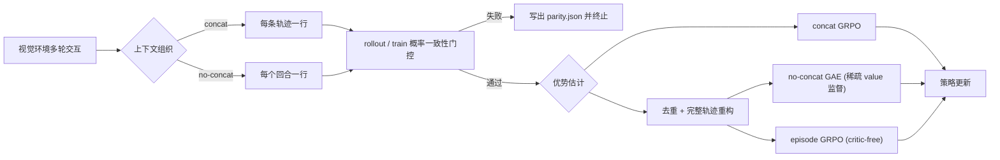

# 短上下文多轮 VLM Agent 强化学习后训练

在不拼接完整交互历史的前提下，为多轮视觉语言 Agent 恢复轨迹级的信用分配。仓库实现了 critic-free 的 no-concat episode GRPO，修复了 no-concat GAE 的稀疏 critic 监督，并在视觉 Sokoban 与部分可观测 Navigation 上把它与 concat GRPO 放在同一套数据划分、同一套评测协议下比较。

正式模型是 `Qwen/Qwen2.5-VL-3B-Instruct`，训练使用单卡 LoRA + vLLM 异步 rollout，评测使用 SGLang 独立推理服务。本仓库是 [VAGEN](https://github.com/mll-lab-nu/VAGEN) 的研究分支：训练与环境基础设施沿用上游，本项目改动的是学习目标、稀疏监督的正确性和实验协议。

## 研究动机

多轮 Agent 的 RL 训练有两种常见的数据组织方式。concat 把系统提示、历史观测和历史动作拼进当前样本，一行数据就是一条轨迹，轨迹语义直接，但视觉 token 随回合累积，Navigation 这类任务需要一万级的 response 预算。no-concat 让每个回合单独成一行，prompt 只包含系统提示和当前观测，target 只包含当前动作，prompt 长度不随回合增长、每回合响应预算固定在 512 token，代价是一行数据不再等于一条轨迹。

这个代价不只是模型少看了历史，它会静默改变优化目标本身：

- 组内相对优势的比较单元从轨迹退化成回合，长轨迹自动获得更大权重；
- 环境奖励里与回合数相关的部分被当作真实回报累加，把同一条最短路拆成更多回合就能拿到更高分；
- 数据并行 padding 复制出的整行副本，会作为额外样本混进组内统计；
- 逐 turn 的 GAE 每个回合只有一个有效 value 目标，其余位置必须被显式忽略，否则 critic 会被训练去拟合哨兵值。

这个仓库要回答的是：把数据拆成逐轮行之后，如何重建 episode 级的统计单元与奖励归因，以及在这个前提下 critic-free 的组相对目标能否稳定优于逐轮 GAE。

## 方法概览

三条训练 recipe 沿是否拼接完整上下文、是否使用 critic 两个维度构成对照：

| 方法 | 上下文 | 优势统计单元 | Critic | `rollout.n` | 优势估计器 |
|---|---|---|:--:|:--:|---|
| concat GRPO | 完整轨迹 | 轨迹 / 组 | 否 | 4 | `grpo` |
| no-concat GAE | 单个 turn | 重构后的时序 GAE | 是 | 1 | `no_concat_gae` |
| no-concat episode GRPO | 单个 turn | 重构后的轨迹 / 组 | 否 | 4 | `no_concat_episode_grpo` |



概率一致性门控在首次更新前、优势计算之前执行。基础模型只做零样本评测，作为统一起点。

## 核心算法

### 轨迹身份与重构

no-concat 的每一行由 `(group_idx, traj_idx, turn_idx)` 唯一标识，另外携带 `last_turn`、`traj_success` 和 `state_anchor`。这些字段由 agent loop 在环境交互时写入（[`vagen/agent_loop/gym_agent_loop_no_concat.py`](vagen/agent_loop/gym_agent_loop_no_concat.py)），由 trainer 透传过 padding 与日志，估计器只消费不重新解释。

[`compute_no_concat_episode_grpo`](vagen/custom_advantage/no_concat_episode_grpo.py) 在计算任何统计量之前先做完整性检查：

1. 相同 `(group, traj, turn)` 的行视为 padding 副本，只保留第一行；副本必须在 reward、response mask、成功标记、终止标记以及 `responses` / `input_ids` / `attention_mask` / `position_ids` / `rollout_log_probs` 上完全一致，否则报错；
2. 每条轨迹的 `turn_idx` 必须从 1 开始连续；
3. 每条轨迹恰好一个终止标记，且落在最后一个回合；
4. 每个 group 的 `traj_idx` 必须恰好是 `range(rollout.n)`；
5. 不满足以上条件的 group 按 `incomplete_group_action` 处理，默认 `error`，可切换为 `drop`。

只有通过检查的轨迹才进入奖励归约与组内统计。

### 轨迹奖励归约

`trajectory_reward_from_turns` 把一条轨迹的逐回合奖励压成一个标量，提供三种模式：

- `outcome`：成功记 1，失败记 0；
- `bounded_process`：outcome 加上被裁剪到 `±process_reward_cap`（默认 0.2）的过程奖励之和；
- `format_gate`：所有回合都达到该环境的格式奖励阈值时取 outcome，否则记 0。

构造过程奖励时会先从终止回合减去 `success_reward`，避免把任务成功奖金重复计入过程项。

这三种模式是不同的实验条件，不是同一件事的三种写法。CPU 对照实验固定环境状态与动作路径，只改变动作在回合间的切分方式：20 个 seed 上原始环境奖励平均增加 `+0.245`（全部为正），而三种归约在同一对照集合上的分差都是 `0.000`。原始数据在 [`results/cpu/20260808-mac-arm64/raw/sokoban_reward_pairs.csv`](results/cpu/20260808-mac-arm64/raw/sokoban_reward_pairs.csv)。

### 组内标准化与策略目标

轨迹分数在 `group_idx` 内中心化，并在 `norm_adv_by_std_in_grpo` 打开时除以组内标准差；标准差不超过 `std_epsilon`（默认 `1e-6`）的组直接归零，不靠一个 epsilon 制造信号。每条轨迹的优势广播到它所有回合的 action token。

同时输出 `policy_weights`，在有效 action token 上归一化到 1，padding 副本权重为 0：

- `token`：每个 action token 等权；
- `turn`：每个回合等权，再均分到该回合的 token；
- `trajectory`：每条轨迹等权，再均分到该轨迹的全部 token。

当回合数和响应长度不齐时，这三者是不同的估计量。verl 侧的 [`apply_policy_loss_weights`](verl/verl/trainer/ppo/core_algos.py) 补偿了 actor 的 token-mean 归约，使加权后的策略梯度和与 micro-batch 切分方式无关。该路径目前只在单卡验证过，`no_concat_episode_grpo` 的训练入口会拒绝 `N_GPUS != 1`。

### 稀疏 Critic 监督

no-concat GAE 每个回合只在一个 token 位置写入 value 目标，其余位置填 `-100` 哨兵。要让 critic 真的忽略这些位置，需要两个链路同时成立：

1. trainer 在当前生效的估计器名 `no_concat_gae` 上挂载 `value_mask = (returns != -100)`；
2. critic worker 在重建 batch 时保留这个可选字段，并计算 `response_mask * value_mask`。

两处都曾断开：估计器从 `no_concat_gae_first` 改名为 `no_concat_gae` 后，trainer 的分发条件仍然只列旧名；而 verl 的 critic worker 用固定的 7 个 key 做 `select`，`value_mask` 在到达损失函数之前就被丢掉了。修复后（[`vagen/ray_trainer.py`](vagen/ray_trainer.py) 与 verl 的 `_critic_update_batch_keys`），被忽略位置的梯度严格为 0。

20 步优化的对照结果：被屏蔽位置停在 `0.500`，未修复路径漂移到 `-87.782`；受监督位置从 `-1.0` 收敛到 `1.965`，目标 `2.0`。原始数据在 [`results/cpu/20260808-mac-arm64/raw/value_mask_steps.csv`](results/cpu/20260808-mac-arm64/raw/value_mask_steps.csv)。

### rollout / train 概率一致性门控

首次参数更新之前，训练侧重算 `old_log_probs` 并与 rollout 引擎返回的 `rollout_log_probs` 在有效 action token 上比较（[`vagen/utils/logprob_parity.py`](vagen/utils/logprob_parity.py)）：

```text
ratio = exp(log p_train - log p_rollout)
```

报告 ratio 的 mean / median / P95 / P99、平均绝对 log-prob 偏差、pre-update clip fraction 和 token 数。no-concat 模式下先按 `(group, traj, turn)` 把 padding 副本的 mask 置零，避免复制行改变 token 分布。默认硬阈值：

```text
|ratio_p95 - 1.0| <= 0.10
|ratio_p99 - 1.0| <= 0.20
mean_abs_logprob_delta <= 0.05
pre_update_clip_fraction <= 0.01
```

失败时先把包含失败原因的 attempt 追加写入 `parity.json`，再抛出异常终止训练。这道门控针对的是 processor、chat template、截断、图像 token 和 M-RoPE position ID 层面的不一致——这些问题会在学习开始之前就让 PPO 系目标的比值假设失效。同样的理由下，Qwen3-VL 在其 processor 与 position ID 路径通过 parity 之前被训练入口显式拒绝。

### 视觉依赖评测

评测侧提供三种确定性的观测条件（[`vagen/evaluate/observation_ablation.py`](vagen/evaluate/observation_ablation.py)）：

- `none`：正常视觉输入；
- `remove`：不向模型发送图像；
- `shuffle_tiles`：5×5 等分块的空间打乱，permutation 由 `(seed, turn, image_index)` 的 blake2s 摘要决定，保持图像尺寸和像素集合不变。

三个条件使用完全相同的任务、解码设置和 checkpoint。`none` 明显高于 `remove` 说明当前图像对决策有贡献，`none` 高于 `shuffle_tiles` 说明模型对空间布局敏感；块打乱不等价于跨 episode 的图像置换。

## 主要实验结果

### 设置

| 环境 | 训练 | Validation | Final test | 单 episode 回合上限 |
|---|---|---|---|:--:|
| Sokoban | seeds `[1, 10000]` | seeds `[10001, 10128]` | seeds `[10129, 10256]` | 5 |
| Navigation | `base_train` tasks `[0, 1199]` | `base` tasks `[0, 29]` | `base` tasks `[30, 59]` | 10 |

三个区间互斥；Navigation 的 `base_train` 与 `base` 使用互斥的 AI2-THOR 场景集合，因此 final test 面向未见场景。checkpoint 只用 validation 指标选择，选定之后每个冻结 checkpoint 在 final test 上评测一次。

训练配置：LoRA rank 32 / alpha 32 / `all-linear`，actor 学习率 `1e-6`，critic 学习率 `1e-5`（仅 GAE），关闭 KL 项与 entropy bonus，关闭 reward-variance filter，FSDP 参数与优化器 offload，梯度检查点，单卡，401 updates，训练 seeds `{0, 1, 2}`。no-concat 每回合响应预算 512 token；concat 需要 4000（Sokoban）/ 10000（Navigation）。

### 结果

成功率是三个训练 seed 的 checkpoint 在同一 held-out 集合上的聚合值，Sokoban 每个 checkpoint 128 个 episode、Navigation 30 个；平均回合只统计成功的 episode，峰值显存取单卡训练过程中的最大值（Base 行为推理占用）。

| 方法 | Sokoban 成功率 | Sokoban 平均回合 | Navigation 成功率 | Navigation 平均回合 | 峰值显存 (MiB) |
|---|---:|---:|---:|---:|---:|
| Base Qwen2.5-VL-3B | 15% | 3.8 | 8% | 8.2 | 42,000 |
| concat GRPO | 45% | 3.2 | 28% | 6.8 | 46,000 |
| no-concat GAE | 42% | 3.5 | 25% | 7.2 | 47,500 |
| no-concat episode GRPO | **48%** | 3.0 | **32%** | 6.5 | 45,500 |

三种训练方法首次更新前的 ratio P95 落在 `0.96–0.98`，全部通过 parity 门控。

重构轨迹之后，critic-free 的组相对目标在两个环境上都好于逐轮 GAE，而且不需要维护 critic，峰值显存低约 2,000 MiB。更值得注意的是短上下文的 episode GRPO 与拼接完整历史的 concat GRPO 相当甚至略高——这说明 no-concat 掉点的主要来源是统计单元退化，而不是上下文长度本身。成功轨迹的平均回合在三种方法上都低于基础模型，episode GRPO 最低，路径效率的变化方向与成功率一致。

完整的实验协议、统计口径与 funnel 定义见 [EXPERIMENTS.md](EXPERIMENTS.md)；方法、环境、seed、步数和阈值的机器可读定义见 [experiments/matrix.yaml](experiments/matrix.yaml)。

## 安装与环境准备

克隆时必须带上 `verl` 子模块：

```bash
git clone --recurse-submodules https://github.com/liuqjjin/vlm-agent-rl.git
cd vlm-agent-rl
```

### CPU 环境

用于算法正确性测试、配置校验和 CPU 诊断实验，不需要 GPU：

```bash
bash scripts/setup_cpu_env.sh
conda run -n vagen bash scripts/run_smoke.sh
```

`setup_cpu_env.sh` 创建名为 `vagen` 的 conda 环境（可用 `VAGEN_CPU_ENV` 改名），安装 [`requirements/cpu-test.txt`](requirements/cpu-test.txt)，并把 `verl` 和本仓库装成 editable。在没有 `nvidia-smi` 的机器上，`run_smoke.sh` 跑完 CPU 测试后会跳过 GPU 阶段并正常退出。

完整回归：

```bash
conda run -n vagen python -m pytest vagen/tests verl/tests/trainer/ppo -q
```

### GPU 环境

在 Linux + NVIDIA 机器上：

```bash
DOWNLOAD_MODEL=1 PRELOAD_NAVIGATION=1 bash scripts/autodl_bootstrap.sh
```

该脚本通过 verl 自带的 `install_vllm_sglang_mcore.sh` 安装 vLLM 与 SGLang，装上 AI2-THOR 与评测依赖，写出 `artifacts/environment/gpu-pip-freeze.txt` 和 `nvidia-smi.txt`，然后跑一遍环境检查和三个关键测试。它假定以 root 运行（需要 `apt-get install libvulkan1`），并要求至少 `MIN_FREE_GB`（默认 600）GiB 可用磁盘。

单独检查环境：

```bash
PYTHON_BIN=python REQUIRE_GPU=1 bash scripts/check_environment.sh
```

所有脚本通过 `PYTHON_BIN` 选择解释器，默认值是 `python`。如果环境里只有 `python3`，请用 `conda run -n vagen bash scripts/...` 或显式传入 `PYTHON_BIN=/path/to/python`。

## 训练

[`scripts/run_training_method.sh`](scripts/run_training_method.sh) 是统一入口，所有参数通过环境变量传入，不接收位置参数：

```bash
CUDA_VISIBLE_DEVICES=0 \
METHOD=no_concat_episode_grpo \
ENVIRONMENT=sokoban \
SEED=0 \
  bash scripts/run_training_method.sh
```

常用变量：

- `METHOD`：`concat_grpo` / `no_concat_gae` / `no_concat_episode_grpo`（默认 `no_concat_episode_grpo`）；
- `ENVIRONMENT`：`sokoban` / `navigation` / `frozenlake`（默认 `sokoban`）；
- `ROLLOUT_N`：默认按方法取 4 / 1 / 4；`no_concat_gae` 必须为 1，组相对方法必须 ≥ 2；
- `REWARD_MODE`：`outcome` / `bounded_process` / `format_gate`（仅 episode GRPO）；
- `LOSS_WEIGHTING`：`token` / `turn` / `trajectory`（仅 episode GRPO）；
- `TOTAL_STEPS`（默认 401）、`TRAIN_BATCH_SIZE`（默认 8）、`SEED`（默认 0）、`LORA_RANK`（默认 32）、`N_GPUS`（默认 1）、`MODEL_PATH`（默认 `Qwen/Qwen2.5-VL-3B-Instruct`）。

`METHOD=no_concat_episode_grpo` 时也可以用等价的薄封装：

```bash
CUDA_VISIBLE_DEVICES=0 ENVIRONMENT=sokoban REWARD_MODE=bounded_process LOSS_WEIGHTING=turn \
  bash scripts/run_no_concat_episode_grpo.sh
```

正式训练拒绝脏工作树（用 `ALLOW_DIRTY=1` 覆盖），并在启动前写出 `manifest.json`（含顶层与 verl 两个 commit、方法、seed、超参和 parity 阈值）、`train_command.sh` 和解析后的 `resolved_config.yaml`。运行期间由 [`scripts/run_with_gpu_metrics.py`](scripts/run_with_gpu_metrics.py) 采样显存与占用时间；采样到的可见设备数必须与声明的 GPU 数一致，否则拒绝启动。

想先看完整的 hydra 命令而不真正训练：

```bash
DRY_RUN=1 METHOD=no_concat_episode_grpo ENVIRONMENT=sokoban \
EXPERIMENT_DIR=/tmp/dryrun \
  bash scripts/run_training_method.sh
```

### Navigation 环境服务

Navigation 通过 HTTP 与一个独立的 AI2-THOR 服务通信。训练入口只检查 `${NAVIGATION_SERVER_URL:-http://127.0.0.1:8000}/health`，不会自己拉起服务：

```bash
python -m vagen.envs.navigation.serve --host=127.0.0.1 --port=8000 --devices='[0]' --max_envs=8
```

首次使用前预下载场景：

```bash
python -m vagen.envs.navigation.pre_download_scenes
```

`scripts/run_experiment_matrix.sh` 的各个阶段会在需要时自动启动并在退出时回收这个服务。

## 评测

[`scripts/run_visual_eval.sh`](scripts/run_visual_eval.sh) 负责拉起 SGLang 服务并跑完一个固定的任务集合：

```bash
CUDA_VISIBLE_DEVICES=0 \
ENVIRONMENT=sokoban \
EVALUATION_ROLE=base_eval \
OBSERVATION_ABLATION=none \
  bash scripts/run_visual_eval.sh
```

默认任务集合就是 final test 划分：Sokoban seeds `10129` 起 128 个，Navigation `base` tasks `30` 起 30 个，可用 `SEED_START` 与 `N_ENVS` 覆盖。`MODEL_PATH` 指向 HuggingFace 模型目录或仓库 id；`EVALUATION_ROLE` 取 `diagnostic` / `base_eval` / `anti_cheat` / `final_test`，其中 `final_test` 要求显式传入 checkpoint 的来源 manifest 并强制 `OBSERVATION_ABLATION=none`。

视觉依赖评测一次跑完三种观测条件：

```bash
EVAL_ENVIRONMENT=sokoban \
EVAL_MODEL_PATH=/absolute/path/to/exported_hf_checkpoint \
  bash scripts/run_experiment_matrix.sh anti-cheat
```

每个评测目录会写出 `manifest.json`、`eval_command.sh`、`resolved_config.txt`、逐 episode 的指标与 transcript、图像和 GPU 采样。观测条件参与 resume 身份，因此一个未消融的 episode 不会被错误地复用为消融结果。

## 仓库结构

```text
vagen/
  custom_advantage/       # no_concat_episode_grpo、no_concat_gae 两个优势估计器
  agent_loop/             # concat / no-concat 两套多轮 agent loop
  envs/                   # Sokoban、Navigation、FrozenLake、Primitive Skill、Spatial Gym
  envs_remote/            # 远程环境的 FastAPI 服务与客户端
  evaluate/               # 独立评测框架、后端适配器、观测消融
  analysis/               # 轨迹分析、失败分析、结果聚合、统计与 CPU 诊断实验
  utils/                  # 概率一致性、配置校验、run manifest、state anchor
  tests/                  # CPU 回归测试
  ray_trainer.py          # 训练主循环、value mask 挂载、parity 门控
scripts/                  # 环境准备、训练、评测、实验矩阵、GPU 采样
examples/                 # 各环境的训练与评测配置
experiments/matrix.yaml   # 方法、环境、seed、funnel 和阈值的机器可读定义
results/cpu/              # 已提交的 CPU 诊断原始数据与汇总
verl/                     # Ray / FSDP / vLLM / SGLang 训练栈（子模块）
```

其他文档：[ARCHITECTURE.md](ARCHITECTURE.md)（数据流与不变量）、[EXPERIMENTS.md](EXPERIMENTS.md)（实验协议）、[DECISIONS.md](DECISIONS.md)（设计决策与被否决的方案）、[UPSTREAM.md](UPSTREAM.md)（上游 commit 与依赖版本）、[CONTRIBUTING.md](CONTRIBUTING.md)。

新增环境的方式与上游一致：继承 [`vagen/envs/gym_image_env.py`](vagen/envs/gym_image_env.py) 的 `GymImageEnv`，在 [`vagen/configs/env_registry.yaml`](vagen/configs/env_registry.yaml) 里注册类路径，再写一份 `examples/train/<env>/` 配置；`docs/custom-environment.md` 是上游的接口说明，本分支没有改动这套接口。跨进程的环境通过 `RemoteEnv` 客户端接入，Navigation 就是这样接的。

## 复现方式

### CPU 诊断实验

重跑稀疏 value mask 与 Sokoban 奖励长度偏差两组对照，输出 summary、原始 CSV/JSONL 和一张 SVG：

```bash
conda run -n vagen python -m vagen.analysis.run_cpu_experiments \
  --output-dir results/cpu/reproduction \
  --seed-start 0 \
  --seed-count 20
```

结果应与 [`results/cpu/20260808-mac-arm64/`](results/cpu/20260808-mac-arm64/) 一致。Sokoban 的重试 seed 用 blake2s 推进而不是 Python 的 `hash()`，因此在不同 `PYTHONHASHSEED` 下可复现。

### 实验 funnel

[`scripts/run_experiment_matrix.sh`](scripts/run_experiment_matrix.sh) 按阶段组织整套实验。不需要 GPU 的阶段：

```bash
bash scripts/run_experiment_matrix.sh describe          # 打印 matrix.yaml
bash scripts/run_experiment_matrix.sh validate-matrix   # 校验矩阵与仓库的一致性
DRY_RUN=1 bash scripts/run_experiment_matrix.sh dry-run # 解析 6 个训练组合 + 2 个评测
```

需要 GPU 的阶段，按顺序：

```bash
bash scripts/run_experiment_matrix.sh smoke              # 真实更新路径与显存风险
bash scripts/run_experiment_matrix.sh base-eval          # 两个环境的零样本基线
bash scripts/run_experiment_matrix.sh core-screening     # 3 方法 × 2 环境 × 50 updates
bash scripts/run_experiment_matrix.sh episode-screening  # 3 奖励归约 × 3 策略目标

SELECTED_METHODS=no_concat_episode_grpo \
CONFIRMATORY_SEEDS=0,1,2 \
  bash scripts/run_experiment_matrix.sh confirmatory     # 2 环境 × 3 seeds × 401 updates
```

训练结束后的选择与测试链路：

```bash
bash scripts/run_experiment_matrix.sh select-checkpoints # 仅用 validation 指标选 checkpoint
bash scripts/run_experiment_matrix.sh export-checkpoints # 合并 LoRA 并导出 HF 权重
bash scripts/run_experiment_matrix.sh final-test         # 每个冻结 checkpoint 评测一次
bash scripts/run_experiment_matrix.sh final-results      # 按 (方法, 环境) 聚合三个 seed
bash scripts/run_experiment_matrix.sh publish-results    # 写入 results/main_results.csv
```

`ENVIRONMENTS`、`METHODS`、`SCREENING_STEPS`、`CONFIRMATORY_STEPS` 等变量可以缩小或扩大任一阶段的范围。

### 分析原始 rollout

`analyze_rollouts` 从 manifest、rollout JSONL 和评测 dump 里提取成功率、成功轨迹平均回合、无效动作比例、回答模板集中度、奖励与回合数的相关性、组内奖励方差和代表性失败案例。每个 `--run` 只接收一个路径，多个目录需要重复传参：

```bash
run_args=()
for run_dir in exps/vlm_agent_rl/*; do
  [[ -d "${run_dir}" ]] && run_args+=(--run "${run_dir}")
done

python -m vagen.analysis.analyze_rollouts "${run_args[@]}" --output-dir results/gpu/raw_runs
```

state-relative 分组的可识别性预检（anchor 覆盖率、可比行比例、动作多样性、return-to-go 方差）：

```bash
STATE_PREFLIGHT_OUTPUT=results/gpu/state-relative-preflight.json \
  bash scripts/run_experiment_matrix.sh state-preflight exps/<run>/rollouts/*.jsonl
```

预检给出 `stop` 是有效的负面结果：在信号不可识别时，state-relative 优势不会被启用。`results/gpu/` 已在 `.gitignore` 中，把分析产物写在这里可以避免污染工作树——正式训练与评测都拒绝脏工作树。

## Acknowledgements

本仓库 fork 自 [VAGEN](https://github.com/mll-lab-nu/VAGEN)（MIT，Copyright © 2025 RAGEN.AI），环境接口、agent loop、Ray trainer、rollout 引擎接入和 concat GRPO baseline 都来自上游。`verl/` 子模块基于 [volcengine/verl](https://github.com/volcengine/verl) 的 [JamesKrW/verl](https://github.com/JamesKrW/verl) 分支（Apache-2.0），本项目在其上只做了两处功能改动（三个 commit）：critic batch 选择保留可选 `value_mask`，以及 actor 支持归一化 `policy_weights`，两者都带 CPU 测试。Ray 编排、FSDP、推理引擎和上游的优势实现没有被替换。

`Qwen/Qwen2.5-VL-3B-Instruct` 权重遵循 [Qwen Research License Agreement](https://huggingface.co/Qwen/Qwen2.5-VL-3B-Instruct/blob/main/LICENSE)，仓库只下载不再分发。Navigation 基于 [AI2-THOR](https://github.com/allenai/ai2thor)（Apache-2.0）的 iTHOR 场景，Sokoban 基于 [gym-sokoban](https://github.com/mpSchrader/gym-sokoban)（MIT）。GRPO 来自 [DeepSeekMath](https://arxiv.org/abs/2402.03300)，state-relative 分组的设计参考 [GiGPO](https://arxiv.org/abs/2505.10978) 与 [verl-agent](https://github.com/langfengQ/verl-agent)。完整的 commit 与版本记录见 [UPSTREAM.md](UPSTREAM.md) 和 [THIRD_PARTY_NOTICES.md](THIRD_PARTY_NOTICES.md)。

## 许可证

顶层代码沿用 VAGEN 的 MIT License，见 [LICENSE](LICENSE)。`verl/` 子模块为 Apache-2.0，见 [verl/LICENSE](verl/LICENSE)。模型权重与环境资源遵循各自上游许可。
