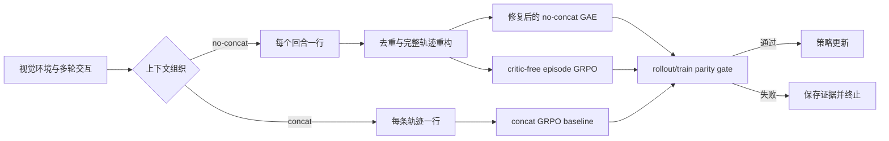

# 短上下文多轮 VLM 智能体强化学习后训练

面向视觉语言智能体的轨迹级信用分配研究：在不拼接完整交互历史的条件下，重建 episode 统计单元，并系统比较 concat GRPO、修复后的 no-concat GAE 与 critic-free no-concat episode GRPO。

> 当前证据分为三类：已提交的 CPU 实测、用于租卡和实验设计的 GPU **保守预测**、尚待外部 CUDA 运行替换的真实 GPU 结果。任何预测值都不作为实测结果陈述。当前验收状态以 [PROJECT_STATUS.md](PROJECT_STATUS.md) 为唯一准则。

## 项目概览

| 维度 | 内容 |
|---|---|
| 研究问题 | 逐轮短上下文训练如何保留完整轨迹的奖励归因语义 |
| 正式模型 | `Qwen/Qwen2.5-VL-3B-Instruct` |
| 任务 | 视觉 Sokoban；部分可观测 Navigation |
| 核心对照 | concat GRPO；修复后的 no-concat GAE；no-concat episode GRPO |
| 主要指标 | held-out 成功率、成功 episode 平均回合数、rollout/train 概率一致性、峰值显存、GPU·h |
| 当前阶段 | 非 GPU 验收与 fresh-clone 交付已通过；GPU 结果待运行 |

## 研究问题与核心贡献

完整轨迹拼接能直接保留 episode 语义，但上下文和视觉 token 会随回合累积；逐轮独立样本保持短上下文，却会把“数据行”误当成“轨迹”，进而破坏奖励归约、组内统计和策略目标的含义。本项目围绕这一冲突完成了以下工作：

1. **轨迹重构与完整性约束**：依据 `(group_idx, traj_idx, turn_idx)` 从逐轮样本重建完整 episode，检查重复行、连续回合、唯一终止标记及 `rollout.n` 完整性。
2. **稀疏 Critic 监督修复**：修复 no-concat GAE 中 `value_mask` 激活与 worker 传递的两处断链，保证忽略位置不进入 critic loss。
3. **Critic-free episode GRPO**：在完整轨迹重构后进行单轨迹奖励归约和组内标准化，并提供 token、turn、trajectory 三种策略目标权重。
4. **训练正确性门控**：在首次更新前比较 rollout 与 training forward 的 log probability；processor、模板、图像 token 或 position ID 不一致时保留报告并终止更新。
5. **受控实验与审计**：用声明式矩阵组织 smoke、screening、confirmatory 和视觉消融；每个正式结果关联代码版本、配置、原始 rollout、概率一致性和 GPU 采样证据。

## 贡献边界

本仓库是 [VAGEN](https://github.com/mll-lab-nu/VAGEN) 的研究分支。项目价值来自对既有训练栈的算法与正确性扩展，而不是重新实现整个分布式框架。

| 来源 | 内容 |
|---|---|
| 上游 VAGEN / verl | Ray/FSDP 训练、vLLM 异步 rollout、SGLang 独立评测、环境交互框架、concat GRPO baseline、既有 no-concat GAE 路径 |
| 本项目修复 | 稀疏 critic mask 断链、padding/轨迹数据完整性、策略权重接入及相关回归验证 |
| 本项目设计 | no-concat episode GRPO、轨迹重构与奖励归约、rollout/train parity gate、实验矩阵、结果审计和统计分析 |
| 基准资源 | Sokoban 与 Navigation 环境、任务数据和模型权重按各自上游许可使用 |

更完整的来源、commit 和许可证信息见 [UPSTREAM.md](UPSTREAM.md) 与 [THIRD_PARTY_NOTICES.md](THIRD_PARTY_NOTICES.md)。

## 方法结构



三条训练 recipe 围绕“是否拼接完整上下文”与“是否使用 critic”形成可比较的实验组，但不把它们宣称为严格的 2×2 因果消融。方法定义、训练预算口径和正式不变量见 [EXPERIMENTS.md](EXPERIMENTS.md)。

## 实验规模

| 实验单元 | 规模 |
|---|---:|
| Sokoban 训练域 | 10,000 个 seeds |
| Sokoban validation / final test | 128 / 128 个互斥 seeds |
| Navigation 训练域 | `base_train` 1,200 个任务 |
| Navigation validation / final test | `base` 中 30 / 30 个互斥任务 |
| 核心 screening | 3 方法 × 2 环境 × 50 updates = 6 runs |
| episode objective screening | 3 奖励模式 × 3 策略目标 × 50 updates = 9 runs |
| 获胜方法 confirmatory | 2 环境 × 3 训练 seeds × 401 updates = 6 runs |
| 完整三方法 confirmatory | 3 方法 × 2 环境 × 3 训练 seeds × 401 updates = 18 runs |
| 获胜方法 final test | 2 环境 × 3 冻结 checkpoints = 6 runs |
| 完整三方法 final test | 3 方法 × 2 环境 × 3 冻结 checkpoints = 18 runs |
| 视觉依赖评测 | 每个环境 3 条件：正常、移除图像、空间块打乱 |

以“筛选一个获胜方法”为主路线时，base evaluation、screening、confirmatory、六个独立 final test 与两环境视觉消融共 35 个正式运行单元；若确认全部三种方法并评测 18 个冻结 checkpoint，则为 59 个。GPU smoke 不计入行为结论。

## 证据分层

| 层级 | 可用于什么结论 | 状态 |
|---|---|---|
| CPU 实测 | 算法不变量、mask 行为、奖励长度偏差、确定性与分析逻辑 | 已提交原始数据 |
| GPU 保守预测 | 卡型选择、预算、结果表预演和异常边界 | 规划值，不是实测 |
| GPU 实测 | 成功率、平均回合、峰值显存、GPU·h、视觉消融、三 seed 稳定性 | 待外部 CUDA 执行 |

### 已提交的 CPU 实测

| 检查 | 观测结果 | 原始证据 |
|---|---:|---|
| 20 步后被忽略的 critic value | 修复后 `0.500`；legacy `-87.782` | [value_mask_steps.csv](results/cpu/20260808-mac-arm64/raw/value_mask_steps.csv) |
| 20 步后受监督 critic value | `1.965`，目标 `2.0` | [summary.json](results/cpu/20260808-mac-arm64/summary.json) |
| 相同最短路径被拆成更多回合后的原始奖励增量 | 均值 `+0.245`；20/20 seeds 为正 | [sokoban_reward_pairs.csv](results/cpu/20260808-mac-arm64/raw/sokoban_reward_pairs.csv) |
| outcome / bounded-process / format-gate 下的长度增量 | 受控集合中均值均为 `0.000` | [summary.json](results/cpu/20260808-mac-arm64/summary.json) |


完整 CPU 回归是否满足 GPU 前置门槛，不在 README 中写死易漂移的测试数量；请查看 [PROJECT_STATUS.md](PROJECT_STATUS.md) 中的最新命令与验收记录。

### GPU 保守预测中央值

下表保留 8 行规划中央值。训练方法的成功率、平均回合和 Ratio P95 表示 seeds `{0,1,2}` 的计划聚合中央值；GPU·h 表示**单环境、单训练 seed** 的预计占卡时间。所有数值均待真实 GPU 结果替换。

| 方法 | 环境 | 成功率 | 峰值显存 (MiB) | GPU·h / seed | 成功平均回合 | Ratio P95 |
|---|---|---:|---:|---:|---:|---:|
| Base Qwen2.5-VL-3B | Sokoban | 15% | 42,000 | 0.8 | 3.8 | — |
| concat GRPO | Sokoban | 45% | 46,000 | 12.5 | 3.2 | 0.98 |
| fixed no-concat GAE | Sokoban | 42% | 47,500 | 14.2 | 3.5 | 0.97 |
| no-concat episode GRPO | Sokoban | **48%** | 45,500 | 12.8 | **3.0** | 0.98 |
| Base Qwen2.5-VL-3B | Navigation | 8% | 42,000 | 1.2 | 8.2 | — |
| concat GRPO | Navigation | 28% | 46,000 | 18.5 | 6.8 | 0.97 |
| fixed no-concat GAE | Navigation | 25% | 47,500 | 20.8 | 7.2 | 0.96 |
| no-concat episode GRPO | Navigation | **32%** | 45,500 | 19.2 | **6.5** | 0.97 |

预测口径、隐含吞吐、误差边界和替换协议见 [PREDICTED_METRICS.md](PREDICTED_METRICS.md)，机器可读中央值见 [results/main_results_predicted.csv](results/main_results_predicted.csv)。待实测登记表位于 [results/main_results.csv](results/main_results.csv)。

### GPU 预算

由上述单 run GPU·h 逐项推导：

| 路线 | 预计 GPU·h | 说明 |
|---|---:|---|
| 筛选后仅确认获胜方法 | 约 134–137 | 含 smoke、base、两类 screening、2 环境 × 3 seeds confirmatory、6 次独立 final test，以及 1–2 环境视觉消融 |
| 完整确认三种方法 | 约 344–347 | confirmatory 为 3 方法 × 2 环境 × 3 seeds，并为 18 个冻结 checkpoint 分别执行 final test |

AutoDL 金额不在仓库中固定为美元或某个历史单价。实际预算为 `GPU·h × 租用时的人民币小时单价`，并应预留下载、故障重跑和结果备份时间。
Checkpoint export/LoRA merge 另按实测计费时间追加，不在上述区间内虚构固定值。

## 复现与验收

### CPU 前置验收

```bash
git clone --recurse-submodules https://github.com/liuqjjin/vlm-agent-rl.git
cd vlm-agent-rl
bash scripts/setup_cpu_env.sh
conda run -n vagen bash scripts/run_smoke.sh
```

复现已提交的 CPU 实验：

```bash
conda run -n vagen python -m vagen.analysis.run_cpu_experiments \
  --output-dir results/cpu/reproduction \
  --seed-start 0 \
  --seed-count 20
```

### GPU 漏斗

[PROJECT_STATUS.md](PROJECT_STATUS.md) 的非 GPU 验收已经通过，外部 GPU 阶段按以下漏斗执行：

```bash
DOWNLOAD_MODEL=1 PRELOAD_NAVIGATION=1 bash scripts/autodl_bootstrap.sh
bash scripts/run_experiment_matrix.sh smoke
bash scripts/run_experiment_matrix.sh base-eval
bash scripts/run_experiment_matrix.sh core-screening
bash scripts/run_experiment_matrix.sh episode-screening

SELECTED_METHODS=no_concat_episode_grpo \
CONFIRMATORY_SEEDS=0,1,2 \
  bash scripts/run_experiment_matrix.sh confirmatory
```

视觉消融必须使用各环境自己的 checkpoint：

```bash
EVAL_ENVIRONMENT=sokoban EVAL_MODEL_PATH=/absolute/path/to/sokoban_hf_checkpoint \
  bash scripts/run_experiment_matrix.sh anti-cheat

EVAL_ENVIRONMENT=navigation EVAL_MODEL_PATH=/absolute/path/to/navigation_hf_checkpoint \
  bash scripts/run_experiment_matrix.sh anti-cheat
```

完整协议、seed 和统计口径见 [EXPERIMENTS.md](EXPERIMENTS.md)。外部机器操作清单在代码与文档最终同步后，以 `GPU_EXECUTION_CHECKLIST.md` 为准。

## 结果汇总

分析器的 `--run` 每次接收一个路径。汇总多个目录时应显式构造重复参数，避免 shell glob 展开成无归属的位置参数：

```bash
run_args=()
for run_dir in exps/vlm_agent_rl/*; do
  [[ -d "${run_dir}" ]] && run_args+=(--run "${run_dir}")
done

python -m vagen.analysis.analyze_rollouts \
  "${run_args[@]}" \
  --output-dir results/gpu/raw_runs
```

原始 per-run 行用于审计；最终 README 和简历使用同一方法在三个训练 seeds 上的聚合结果，并同时报告离散程度或置信区间。

## 仓库导航

- `vagen/custom_advantage/no_concat_episode_grpo.py`：轨迹重构、奖励归约和策略权重。
- `vagen/custom_advantage/no_concat_gae.py`：修复后的逐轮 GAE 路径。
- `vagen/utils/logprob_parity.py`：rollout/train 概率一致性指标与门控。
- `vagen/analysis/analyze_rollouts.py`：行为、失败案例和结果行提取。
- `experiments/matrix.yaml`：方法、环境、seed、funnel 和阈值的声明式真值源。
- `EXPERIMENTS.md`：实验协议和统计口径。
- `PREDICTED_METRICS.md`：GPU 保守预测方法学。
- `PROJECT_STATUS.md`：当前验收状态的唯一事实源。
- `RESUME_PROJECT_CN.md`：GPU 达到目标后的完成态简历模板与面试详版。

## 岗位能力映射

该项目最直接展示的是：

- **VLM / 多模态后训练**：视觉 token 数据流、RL 目标、rollout/train 一致性和多模态评测。
- **强化学习算法**：轨迹级信用分配、group-relative 优势、critic 监督与不同归一化目标。
- **AI Agent**：多轮环境交互、短上下文状态机、长期奖励归因和失败分析。
- **训练与实验系统**：参数高效训练接入、异步采样、失败闭合、统计设计和可复现证据链。

对计算成像、图像处理和影像岗位，本项目提供的是视觉数据流、空间依赖消融、鲁棒性评测和实验方法等可迁移能力；它不包含逆问题、成像物理、重建、分割或医学影像任务，因此不将这些方向描述为项目的直接任务成果。

## 限制

- 当前工作站没有 CUDA；成功率、显存、GPU·h、parity 实测和视觉消融结果仍待外部 GPU。
- no-concat episode GRPO 的正式协议限制为单 GPU，跨 rank 的策略权重等价性尚未验证。
- Qwen3-VL 在 processor、M-RoPE position ID 和 log-probability parity 验证完成前保持 fail-closed。
- state-relative 方法仅实现可识别性 preflight，未进入核心训练矩阵。
- `shuffle_tiles` 是破坏空间布局的确定性控制，不等价于跨 episode 图像置换。

## 许可

顶层项目沿用 VAGEN 的 MIT License；`verl/` 子模块为 Apache-2.0。模型权重和环境资源遵循各自上游许可，详见 [UPSTREAM.md](UPSTREAM.md) 与 [THIRD_PARTY_NOTICES.md](THIRD_PARTY_NOTICES.md)。
