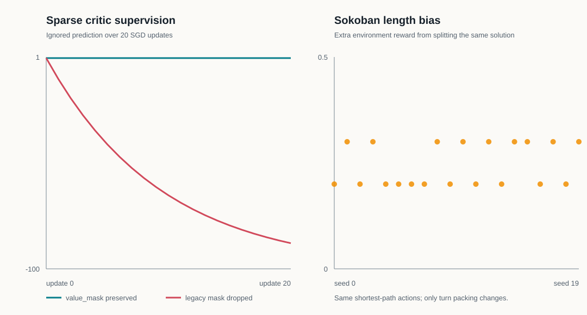
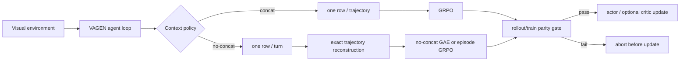

# vlm-agent-rl

Reliable credit assignment for short-context, multi-turn vision-language agents.

This repository is a research fork of [VAGEN](https://github.com/mll-lab-nu/VAGEN). It studies the trade-off between concatenating an entire trajectory and training on independent, short per-turn contexts. The implementation keeps VAGEN’s Ray/FSDP/SGLang infrastructure and concentrates the project delta in tested extension points: sparse critic supervision, trajectory reconstruction, group-relative advantages, policy-loss weighting, parity gates, and analysis.

The first formal visual model is `Qwen/Qwen2.5-VL-3B-Instruct`. Qwen3-VL is deliberately rejected by the no-concat entry point until its processor, M-RoPE position IDs, and rollout/training log-probability parity are validated.

## What is implemented

- A regression-tested repair for both `value_mask` breaks in no-concat GAE. Ignored `-100` return positions no longer reach the critic loss.
- Critic-free no-concat episode GRPO that reconstructs complete `(group_idx, traj_idx)` trajectories before computing group statistics.
- Token-weighted, turn-balanced, and trajectory-balanced policy objectives with padding-duplicate invariance.
- Outcome-only, bounded-process, and format-gated trajectory rewards for the Sokoban length-bias ablation.
- A first-update rollout-versus-training log-probability gate with mean, median, P95, P99, absolute log-probability delta, and pre-update clip fraction.
- Canonical, text-only pre-action state anchors for visual Sokoban and Navigation, including the remaining turn budget; a data preflight blocks state-relative training when the signal is not identifiable.
- Deterministic image-removal and tile-shuffle evaluations, GPU/VRAM accounting, rollout-quality analysis, and representative failure extraction.
- A smoke → screening → confirmatory experiment funnel for Sokoban and partially observable AI2-THOR Navigation.

The detailed data flow is in [ARCHITECTURE.md](ARCHITECTURE.md), and the evidence behind each choice is in [DECISIONS.md](DECISIONS.md).

## Current evidence

The local machine is Apple arm64 without CUDA. All CPU-valid experiments were run; visual model inference and training remain explicitly pending rather than being estimated.

| CPU check | Observed result | Raw evidence |
|---|---:|---|
| Full CPU smoke | 58 tests passed | `scripts/run_smoke.sh` |
| Ignored critic value after 20 updates | fixed `0.500`; legacy `-87.782` | [value_mask_steps.csv](results/cpu/20260727-mac-arm64/raw/value_mask_steps.csv) |
| Supervised critic value after 20 updates | `1.965` toward target `2.0` | [summary.json](results/cpu/20260727-mac-arm64/summary.json) |
| Extra reward from splitting the same shortest path | mean `+0.245`; positive on 20/20 seeds | [sokoban_reward_pairs.csv](results/cpu/20260727-mac-arm64/raw/sokoban_reward_pairs.csv) |
| Length delta after outcome/bounded-process/format-gate reduction | mean `0.000` for all three in this controlled set | [summary.json](results/cpu/20260727-mac-arm64/summary.json) |



The required GPU table is checked in with null values and `pending-external-gpu` status at [results/main_results.csv](results/main_results.csv). No visual success, VRAM, GPU-hour, mean-turn, or ratio value is claimed before a traceable run exists.

| Method | Visual Success | Peak VRAM | GPU·h | Mean Turns | Ratio P95 |
|---|---:|---:|---:|---:|---:|
| Base Qwen2.5-VL-3B | pending | pending | pending | pending | n/a |
| concat GRPO | pending | pending | pending | pending | pending |
| fixed no-concat GAE | pending | pending | pending | pending | pending |
| no-concat episode GRPO | pending | pending | pending | pending | pending |

The table applies separately to Sokoban and Navigation. See [EXPERIMENTS.md](EXPERIMENTS.md) for seeds, gates, and the reporting protocol.

## Architecture



The important no-concat invariant is that a row is a turn, not a trajectory. Episode statistics are therefore computed only after exact duplicate removal, contiguous-turn checks, one-terminal-marker checks, and `rollout.n` completeness checks.

## CPU quick start

```bash
git clone --recurse-submodules https://github.com/liuqjjin/vlm-agent-rl.git
cd vlm-agent-rl

bash scripts/setup_cpu_env.sh
conda run -n vagen bash scripts/run_smoke.sh
```

Reproduce the committed CPU artifacts:

```bash
conda run -n vagen python -m vagen.analysis.run_cpu_experiments \
  --output-dir results/cpu/reproduction \
  --seed-start 0 \
  --seed-count 20
```

The experiment uses a stable retry-seed hash. Its raw outputs were also checked under two different `PYTHONHASHSEED` values.

## CUDA quick start

Use a Linux NVIDIA machine with at least 100 GiB free disk; an 80 GiB GPU is the conservative single-GPU choice for the critic-bearing comparison. On the machine:

```bash
DOWNLOAD_MODEL=1 PRELOAD_NAVIGATION=1 bash scripts/autodl_bootstrap.sh
bash scripts/run_experiment_matrix.sh smoke
```

Inspect every declared run before spending GPU time:

```bash
bash scripts/run_experiment_matrix.sh describe
bash scripts/run_experiment_matrix.sh dry-run
```

Then run the funnel:

```bash
bash scripts/run_experiment_matrix.sh base-eval
bash scripts/run_experiment_matrix.sh core-screening
bash scripts/run_experiment_matrix.sh episode-screening

# Only after selecting the screening winner:
SELECTED_METHODS=no_concat_episode_grpo \
  bash scripts/run_experiment_matrix.sh confirmatory
```

The Navigation server is started and stopped by the matrix runner when necessary. Formal training has `filter.enable=False`, parity gating enabled, offline W&B by default, per-run manifests, raw rollouts, parity JSON, and GPU samples.

Run the visual-dependence checks on a selected checkpoint:

```bash
EVAL_MODEL_PATH=/absolute/path/to/hf_model \
  bash scripts/run_experiment_matrix.sh anti-cheat
```

Summarize completed runs:

```bash
bash scripts/run_experiment_matrix.sh analyze \
  --run exps/vlm_agent_rl/<run-name>
```

If a W&B key was unavailable during training, local logs are complete. They can be uploaded later with:

```bash
WANDB_API_KEY=... bash scripts/sync_wandb.sh
```

AutoDL-specific external actions are reduced to the checklist in [USER_ACTIONS.md](USER_ACTIONS.md).

## Repository map

- `vagen/custom_advantage/no_concat_episode_grpo.py` — trajectory reconstruction, reward reduction, and objective weights.
- `vagen/utils/logprob_parity.py` — ratio metrics, gate, and first-update report.
- `vagen/analysis/` — state-relative preflight, CPU evidence suite, and rollout/failure analysis.
- `scripts/run_training_method.sh` — one pinned entry point for the three trained core methods.
- `experiments/matrix.yaml` — declarative funnel, seeds, invariants, and thresholds.
- `results/` — committed raw CPU data and the GPU result registry.
- `verl/` — the pinned VAGEN verl submodule with two small, separately licensed changes.

## Reproducibility and limits

- Exact upstream commits, local submodule delta, licenses, and dependency pins are recorded in [UPSTREAM.md](UPSTREAM.md).
- The current workstation cannot execute CUDA/SGLang, so the GPU smoke, model baseline, parity measurement, state-relative base-policy preflight, training, and visual failure cases are not complete.
- The state-relative method is intentionally not implemented past its preflight gate. A canonical anchor alone does not prove that comparable states, diverse actions, and return variance occur in model rollouts.
- Tile shuffle is a deterministic spatial-destruction control, not a cross-episode image-permutation test.
- `gym-sokoban` is unmaintained and requires NumPy 1.x and `setuptools<81`; both are pinned.

## Upstream and license

The top-level project remains under VAGEN’s MIT license in [LICENSE](LICENSE). The `verl/` submodule is Apache-2.0 and retains its license and notice. VAGEN and verl-agent authors are credited in [UPSTREAM.md](UPSTREAM.md) and [THIRD_PARTY_NOTICES.md](THIRD_PARTY_NOTICES.md).

If you use the underlying framework, cite the VAGEN paper:

```bibtex
@inproceedings{wang2025vagen,
  title={VAGEN: Reinforcing World Model Reasoning for Multi-Turn VLM Agents},
  author={Kangrui Wang and Pingyue Zhang and Zihan Wang and Yaning Gao and Linjie Li and Qineng Wang and Hanyang Chen and Yiping Lu and Zhengyuan Yang and Lijuan Wang and Ranjay Krishna and Jiajun Wu and Li Fei-Fei and Yejin Choi and Manling Li},
  booktitle={The Thirty-ninth Annual Conference on Neural Information Processing Systems},
  year={2025},
  url={https://arxiv.org/abs/2510.16907}
}
```
